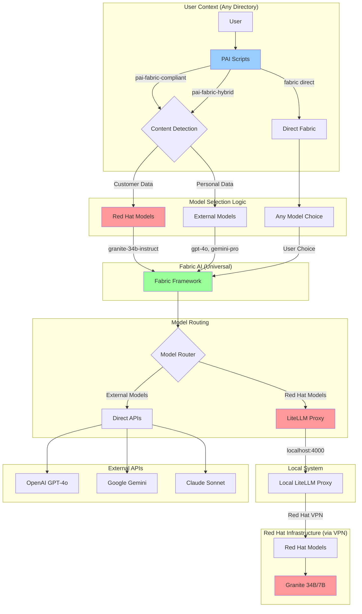
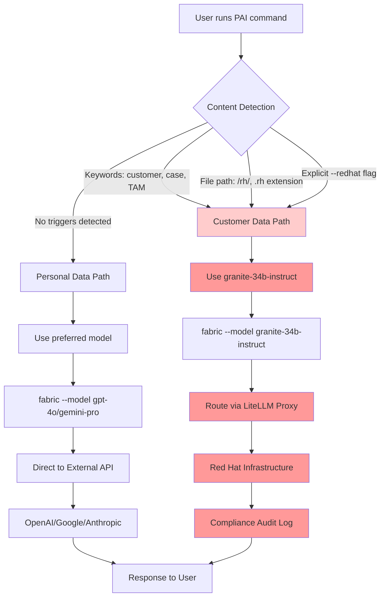
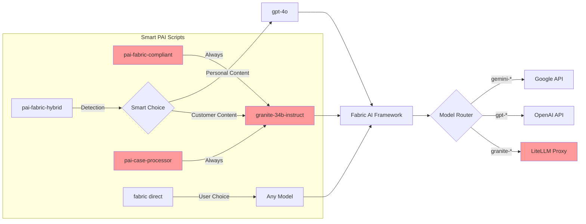
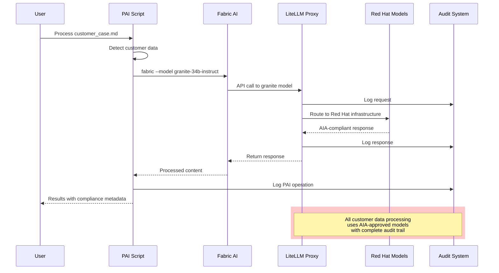
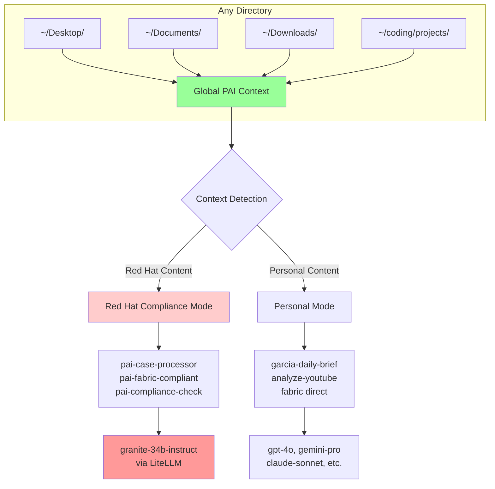

# Red Hat PAI Architecture Diagrams

## 🏗️ **Overall System Architecture**

## 🔄 **Model Selection Flow**

## 🛠️ **PAI Script Intelligence**

## 🔐 **Compliance Flow**

## 🌍 **Global Universal Access**

---

*Visual representation of Red Hat PAI architecture*
*Showing model selection, compliance flow, and universal access*