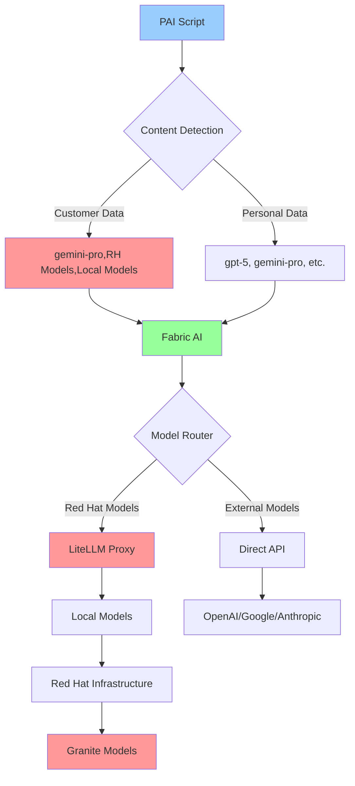
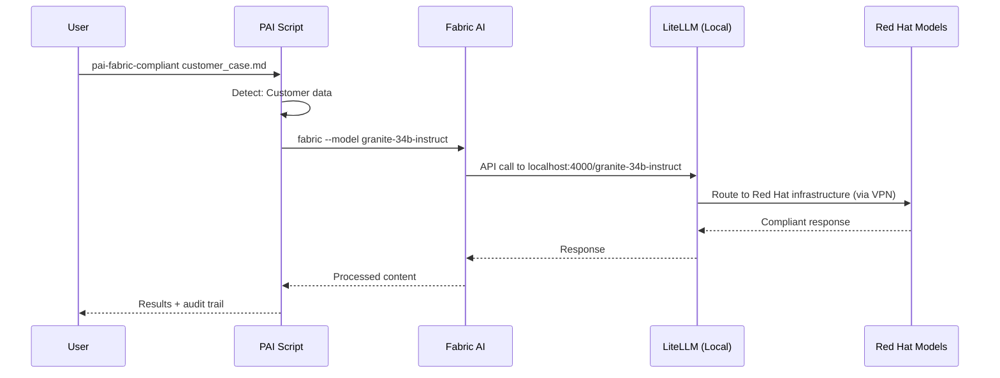

# Red Hat PAI - Personal AI Infrastructure

Personal AI Infrastructure for Red Hat teams, providing unified context management across AI tools while maintaining Red Hat AI policy compliance.

## Features
- **Multi-Tool Integration**: Gemini CLI, Cursor IDE, Fabric AI, LiteLLM Proxy
- **Secure by Design**: External secrets management, no hardcoded credentials
- **TAM Workflow Tools**: Specialized scripts for Technical Account Managers
- **Enterprise Ready**: Clean separation of business contexts

## Prerequisites

**Complete these Red Hat-specific steps first:**

1. **Red Hat AI Models API Keys** (VPN required): https://developer.models.corp.redhat.com
2. **Cursor IDE Setup**: https://source.redhat.com/projects_and_programs/ai/ai_tools/cursor
3. **Gemini API Key**: https://source.redhat.com/departments/it/datacenter_infrastructure/itcloudservices/itpubliccloudpage/cloud/gcp/gcpgeminiapi
4. **Personal Access Token**: https://spaces.redhat.com/spaces/OMEGA/pages/228005232/Personal+Access+Token+Usage

## Quick Install

```bash
curl -sSL https://gitlab.cee.redhat.com/gvaughn/hatter-pai/-/raw/main/install.sh | bash
```

The installer will verify you've completed the prerequisites before proceeding.

## What You Get

### AI Tools Integration
- **Gemini CLI**: `gemini` with Hatter personality and Red Hat context
- **Cursor IDE**: Project-specific rules and context
- **Fabric AI**: Red Hat compliant patterns and processing via LiteLLM model selection
- **LiteLLM Proxy**: Local proxy for Red Hat AI models with compliance routing

### Red Hat Workflow Scripts
- **Case Management**: pai-case-processor, pai-supportshell, pai-case-sync-improved
- **Customer Tools**: pai-hydra, pai-onboard-customer, pai-meeting-prep
- **Compliance**: pai-compliance-check, pai-audit, pai-fabric-compliant
- **Documentation**: pai-confluence, pai-gdocs-sync, pai-projects

### Security & Compliance
- **Secrets Management**: External secrets in `~/.config/pai/secrets/`
- **Audit Logging**: Complete audit trail for all operations
- **Data Classification**: Automatic Red Hat model routing
- **Zero Hardcoded Credentials**: All authentication externalized

## Directory Structure

```
~/pai-context/
├── redhat/                 # Red Hat business context
│   ├── contexts/           # Hatter personality, Red Hat context
│   ├── config/             # Red Hat model configurations
│   └── bin/                # Red Hat workflow scripts
└── personal/               # Personal/other business contexts

~/.config/pai/
└── secrets/                # Secure credential storage (NOT in repo)
```

## Usage Examples

```bash
# Check current PAI status
pai-context-current

# Process a support case
pai-case-processor

# Generate compliance brief
pai-brief-generate

# Use Gemini with Red Hat context
gemini
> Run pai-supportshell for case 04243222
```

## Installation for Red Hat Teams

The installation script:
1. Creates Red Hat PAI context structure
2. Installs Fabric AI and LiteLLM proxy locally
3. Installs Red Hat specific workflow scripts
4. Configures Gemini CLI with Hatter personality
5. Sets up secure secrets management
6. Configures Cursor IDE integration
7. Starts local LiteLLM proxy for Red Hat model access

## 🧠 **How Fabric + LiteLLM Works**



**Fabric AI knows about ALL models**:
- OpenAI models: `gpt-4o`, `gpt-5`, `o1-preview`
- Google models: `gemini-pro`, `gemini-flash`
- Anthropic models: `claude-3-5-sonnet`, `claude-3-haiku`
- **Red Hat models (via LiteLLM)**: `granite-34b-instruct`, `granite-7b-instruct`

### Smart PAI Script Wrappers

```bash
# pai-fabric-compliant: Always uses Red Hat Granite models
pai-fabric-compliant --pattern extract_wisdom customer_case.md
# Internally runs: fabric --model granite-34b-instruct --pattern extract_wisdom

# pai-fabric-hybrid: Context-aware model selection
pai-fabric-hybrid --pattern summarize mixed_content.md
# Customer data detected → uses granite-34b-instruct
# Personal data → uses gpt-4o (or your preference)

# Direct fabric: Full model choice for personal work
fabric --model gemini-pro --pattern daily_brief personal_notes.md
```

### LiteLLM: The Local Bridge to Red Hat Models



**LiteLLM Proxy Configuration** (installed locally):
```yaml
model_list:
  - model_name: granite-34b-instruct
    litellm_params:
      model: granite-34b-instruct
      base_url: http://rh-internal-models:8080  # via Red Hat VPN
```

**Result**: Fabric sees `granite-34b-instruct` as just another model available at localhost!

### Compliance Made Simple

```bash
# For customer data - PAI scripts choose compliant models automatically
pai-case-processor support_ticket.md        # Uses granite-34b-instruct
pai-email-processor customer_email.txt      # Uses granite-34b-instruct

# For personal work - use any model you want
fabric --model gpt-4o --pattern extract_ideas personal_research.md
fabric --model gemini-pro --pattern summarize meeting_notes.md
```

📊 **For detailed architecture diagrams and flows, see [ARCHITECTURE-DIAGRAM.md](./ARCHITECTURE-DIAGRAM.md)**

## Requirements

- **Fabric AI**: Single installation, knows all models
- **LiteLLM**: Installed locally as part of redhat-pai setup
- Node.js (for Gemini CLI)
- Git access to gitlab.cee.redhat.com
- Red Hat VPN for internal model access (LiteLLM connects through VPN)

## Enterprise Deployment

This repository contains only Red Hat-specific content:
- No personal business information
- No health or consulting data
- No email sync or personal secrets
- Only Red Hat TAM and technical workflows

Perfect for enterprise sharing and team deployment while maintaining privacy separation.
